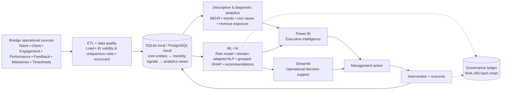

# BredgePulse Architecture

## Implemented (MVP)

One database layer (`core/db.py`) runs the same code on SQLite locally and PostgreSQL
(Neon) in the cloud; the environment is selected by `DB_URL` alone. The build is batch:
`run_all.py` runs every stage in dependency order.

## Production scale-out path (target architecture, not implemented)

The MVP is sized for a 1,200-engagement pilot, where batch processing on one relational
database is the right choice. At full-portfolio scale, and once signals arrive
continuously instead of monthly, each layer has a natural next step. This section is a
roadmap for Q3–Q4 and beyond; none of these components exist in this repository.

| Need at scale | Target component | Replaces / extends |
|---|---|---|
| Timesheets, check-ins and feedback arrive as events, not monthly files | **Apache Kafka** topics per source, consumed into the database | batch CSV load in `etl/load.py` |
| Time-stamped operational metrics (utilisation, hours, response times) at daily or hourly grain | **InfluxDB** time-series store feeding the BEHS feature engine | monthly `timesheets` table |
| Free-text check-in notes and feedback with varying structure | **MongoDB** document store for raw notes; the NLP output stays relational | `client_feedback.comment` / `checkins.note` columns |
| Search across years of feedback ("every engagement mentioning handover issues") | **Elasticsearch** (Apache Lucene) index over notes and feedback | keyword taxonomy lookups |
| Feature engineering over the full history of every engagement | **Apache Spark** batch jobs on a distributed store (Hive tables on HDFS/object storage) | pandas in `base/features/build_features.py` |
| Richer summaries of check-in notes for account managers | An **LLM** summarisation step, human-reviewed, notarized like any other recommendation | keyword issue classifier |

Design principle carried forward: each layer only reads from the layer before it, and
every model output and intervention is notarized in the governance ledger, whatever the
underlying store.
